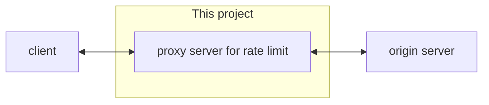
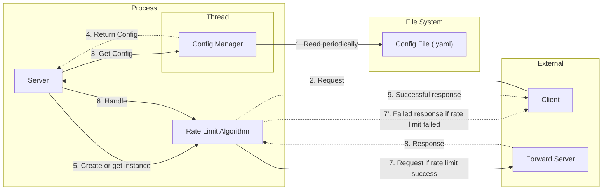
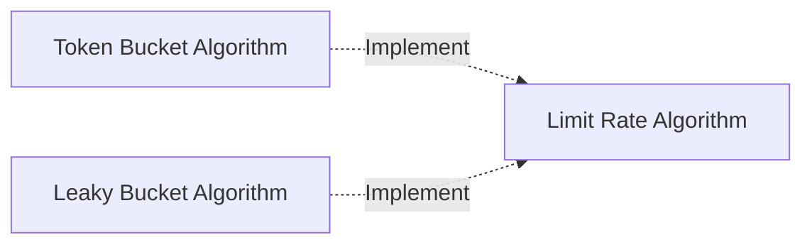
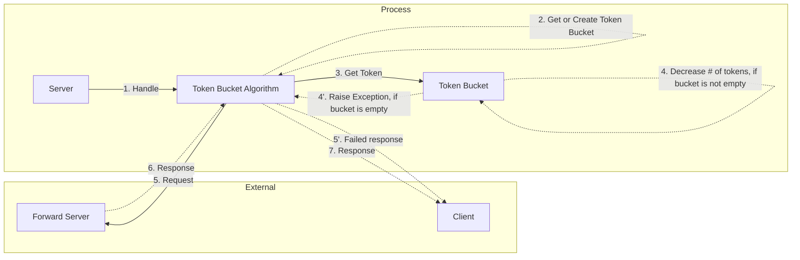
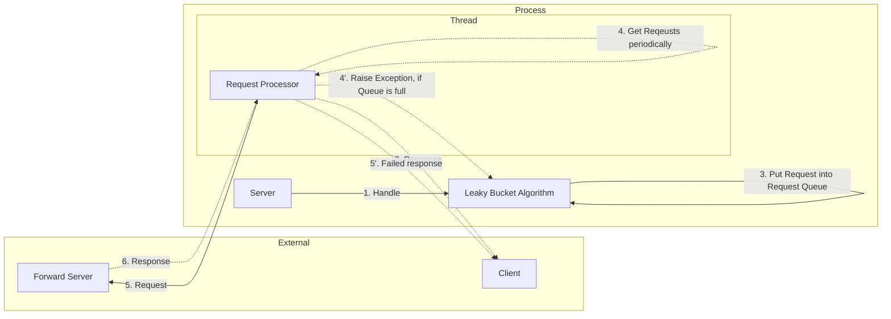
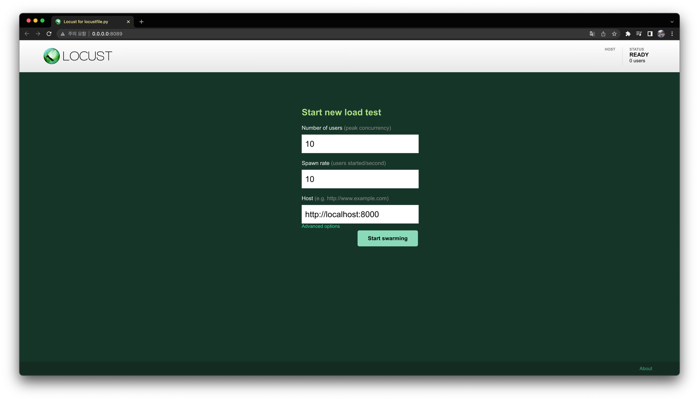
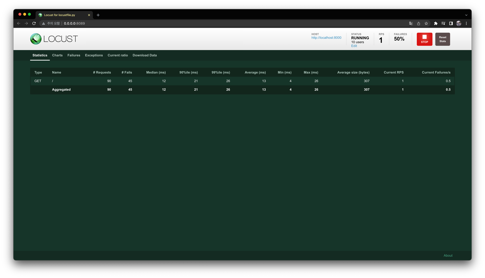
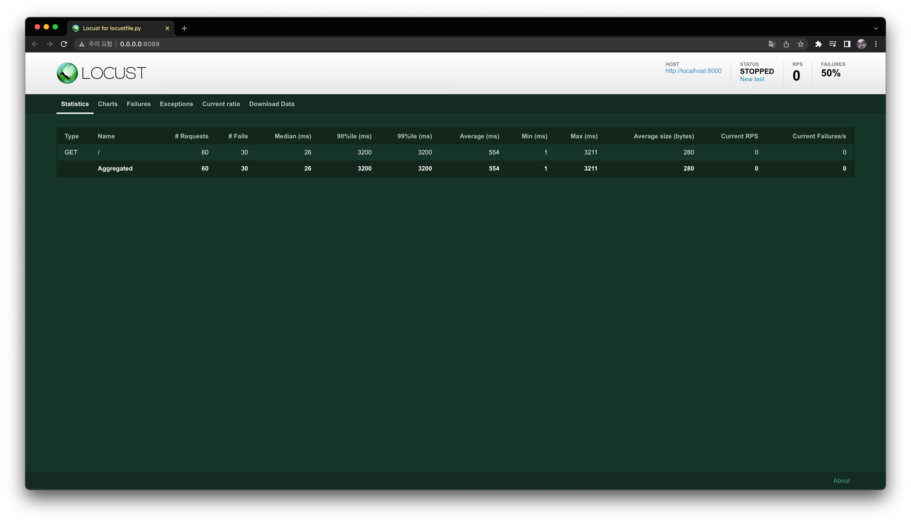

# 04-design-a-rate-limiter

## Tech Specs

### Goal

Implement a rate limiter from Chapter 4.

### Requirements

- Must implement at least one of the following rate limit algorithms:
  - Token bucket
  - Leaky bucket
  - Fixed window counter
  - Moving window log
  - Moving window counter
- The configuration for rate limit algorithm (ex. maximum number of requests per second) must be able to be modified without interruption.
- It must be done through HTTP communication, and the following contents must be included in the header of the server response.
  - X-Ratelimit-Remaining
  - X-Ratelimit-Limit
  - X-Ratelimit-Retry-After
- The implemented algorithm must be testable by anyone, and the document on which the test was conducted must remain.
  - For example, everyone should be able to see the graph in the document where the number of success requests are limited when the load is given.
- README.md should contain **at least the following contents**.
  - Architecture
    - Diagrams that can show dependencies between modules or classes
    - Description of the workflow
  - How to run the test
  - Documents referenced

## Usage

### Installation

Pre-requisites are as follows.

- python >= 3.10
- clone this repo

Install as follows.

```bash
$ poetry install
```

### How To Run

First, create `config.yaml` and then write it like this.

```yaml
common:
  forward_host: 127.0.0.1
  forward_port: 8080
  socket_buf_size: 1024
rate_limit_algorithm: token bucket
token_bucket:
  periodic_second: 1
  n_tokens_to_be_added_per_periodic_second: 1
  token_bucket_size: 5
leaky_bucket:
  periodic_second: 0.1
  n_request_to_be_processed_per_periodic_second: 5
  request_queue_size: 5
```

And run the app like this.

```bash
$ export PYTHONPATH=.
$ python src/main.py -c src/config.yaml

2022-12-10 21:22:15,335 INFO     [server.py:26] Server - start listening on 0.0.0.0:8000
```

### Arguments & Configurations

**Static config values** are set as arguments of Python commands, and **dynamic config values** are stored in `config.yaml`.

The static config value is set once when the app is run, and if you want to change the value later, you must quit the app and run it again with the value as an argument.
You can check the explanation of the argument with the help command.

```bash
$ python src/main.py --help

usage: main.py [-h] [-c] [-hn] [-p] [-f] [-v]

options:
  -h, --help          show this help message and exit
  -c , --config       config file (.yaml) path
  -hn , --hostname    hostname for listening
  -p , --port         port for listening
  -f , --log-format   log format
  -v, --verbose       print debug logs
```

Dynamic config values can be changed while the app is running, and the app parses config.yaml every 3 seconds by default to check for changes.
The values contained in `config.yaml` is as follows.

| Name                                                       | Description                                                                                               | Default Value |
|------------------------------------------------------------|-----------------------------------------------------------------------------------------------------------|---------------|
| common.forward_host                                        | Host of forwarding server                                                                                 | 127.0.0.1     |
| common.forward_port                                        | Port of forwarding server                                                                                 | 8080          |
| common.socket_buf_size                                     | Socker buffer size used for listening client and forwarding server                                        | 1024          |
| rate_limit_algorithm                                       | Rate limit algorithm to use. <br>You can choose one of the followings<br>- token bucket<br>- leaky bucket | token bucket  |
| token_bucket.periodic_second                               | Time period (second) for putting tokens in buckets                                                        | 1             |
| token_bucket.n_tokens_to_be_added_per_periodic_second      | The number of tokens to bucket in a time period                                                           | 2             |
| token_bucket.token_bucket_size                             | Bucket size. Responds with 429 when the number of requests exceeds this queue.                            | 2             |
| leaky_bucket.periodic_second                               | Time period (second) for pulling requests from the queue and processing them                              | 1             |
| leaky_bucket.n_request_to_be_processed_per_periodic_second | Number of requests to be dequeued per periodic_second                                                     | 2             |
| leaky_bucket.request_queue_size                            | Size of the queue. Responds with 429 when the number of requests exceeds this queue.                      | 2             |

If you use a `leaky bucket` as the `rate_limit_algorithm`, you don't have to worry about the values related to the `token bucket`.
The opposite is also true.

For an example of `config.yaml` check out [this file](./src/config.yaml).

### Use Cases

This app can be used as following.

First, run the web application server that will be located behind the throughput limiter as follows.
Here, we will assume that nginx is this server and run it.

```bash
$ docker run --name my-web-application -p 8080:80 nginx:latest
```

Next, prepare `config.yaml` as follows, and start this rate limit server as follows.

```yaml
common:
  forward_host: 127.0.0.1
  forward_port: 8080
  socket_buf_size: 1024
rate_limit_algorithm: token bucket
token_bucket:
  periodic_second: 1
  n_tokens_to_be_added_per_periodic_second: 1
  token_bucket_size: 5
leaky_bucket:
  periodic_second: 0.1
  n_request_to_be_processed_per_periodic_second: 5
  request_queue_size: 5
```

```bash
$ python src/main.py -c config.yaml
```

Now, if the client sends an HTTP request to this rate limit server as follows, you can receive a response with the throughput limit applied as follows.

```bash
# when request succeed.

$ curl -v http://localhost:8000

*   Trying 127.0.0.1:8000...
* Connected to localhost (127.0.0.1) port 8000 (#0)

> GET / HTTP/1.1
> Host: localhost:8000
> User-Agent: curl/7.79.1
> Accept: */*
>
* Mark bundle as not supporting multiuse
< HTTP/1.1 200 OK
< Server: nginx/1.23.2
< Date: Sun, 11 Dec 2022 07:42:51 GMT
< Content-Type: text/html
< Content-Length: 615
< Last-Modified: Wed, 19 Oct 2022 07:56:21 GMT
< Connection: keep-alive
< ETag: "634fada5-267"
< Accept-Ranges: bytes
< X-Ratelimit-Remaining: 0
< X-Ratelimit-Limit: 5
< X-Ratelimit-Retry-After: 1
<
<!DOCTYPE html>
<html>
...
```

```bash
# when request failed.

$ curl -v http://localhost:8000

*   Trying 127.0.0.1:8000...
* Connected to localhost (127.0.0.1) port 8000 (#0)

> GET / HTTP/1.1
> Host: localhost:8000
> User-Agent: curl/7.79.1
> Accept: */*
>
* Mark bundle as not supporting multiuse
< HTTP/1.1 429 Too many requests
< Content-Type: text/plan; encoding=utf8
< Content-Length: 26
< Connection: close
< X-Ratelimit-Remaining: 0
< X-Ratelimit-Limit: 5
< X-Ratelimit-Retry-After: 1
<
* Closing connection 0
Please retry after minutes
```

## System Design

### Concept

A reverse proxy server for rate limiter.



The client makes a request to this proxy server,
and this proxy server forwards it to the original server if there is no problem with the rate limit.

### Architecture



The workflow is as follows.

```
1. When the app is started, the Config Manager is first started as a thread, and config.yaml is read periodically, created as a Config instance, and saved.
   If config.yaml is not passed as a parameter, the default Config instance is used, and config.yaml is not read periodically.
2. The client makes an HTTP request to the server.
3. After checking whether the Config value has changed from the Config Manager, Server makes a request to the Config Manager for Config
4. Config Manager return the most recent Config instance to Server.
5. Based on the Config instance, a Rate Limit Algorithm is created to process the request.
6. Server asks the Rate Limit Algorithm to handle the request.
7. If the request is allowed by the Rate Limit Algorithm, the request is sent back to the Forward Server.
   If the request is not allowed by the Rate Limit Algorithm, Server responds with 429 code to the client. (Workflow Ends)
8. If the forward Server responds successfully, the response is sent back to the Server
9. Server sent back successful response to Client
```

### Details

The Rate Limit Algorithm object is an abstract component, which is actually implemented with the following two objects.

- Token Bucket Algorithm
- Leaky Bucket Algorithm



Which of the above implementation instances the Rate Limit Algorithm instance will be depends on the value set in `config.yaml`
, or the default value if `config.yaml` does not exist.

Here, I will explain more about how the actual logic differs for each of the above implementations.

#### Token Bucket Algorithm



A description of the workflow follows.

```
1. The Server requests the Token Bucket Algorithm to process the request.
2. Token Bucket Algorithm manages Token Bucket as an internal variable. Get if exist or create this if not exist yet.
3. Request a token from the imported Token Bucket.

After this, depending on the case, it proceeds in two ways.

The next is when the Bucket is not empty.

4. Token Bucket decreases the number of tokens in the Bucket by one.
5-6. Token Bucket Algorithm sends a request to the Forward Server and receives a response.
7. Token Bucket Algorithm sends a response to the client.
```

The next is when the Bucket is empty.

4'. Token Bucket throws an exception saying there are no tokens in the bucket.
5'. Token Bucket Algorithm sends a 429 response to the Client.

#### Leaky Bucket Algorithm


A description of the workflow follows.

```
1. The Server requests the Leaky Bucket Algorithm to process the request.
2. Token Bucket Algorithm manages Request Processor and Request Queue as an internal variables. Get if exist or create these if not exist yet.
3. The Token Bucket Algorithm try to put the request into Request Queue.

After this, depending on the case, it proceeds in two ways.

The next is when the queue is not in full state.

4. The Request Processor periodically pulls requests out of the internal queue.
5-6. Request Processor sends out requests to Forward Server and receives responses.
7. Request Processor sends a response to the Client.

The next is when the queue is in full state.

4'. Throw an exception that the queue is full.
5'. Request Processors sends a 429 response to the Client.
```

### Limitations

I will explain the current limitations of this app.

- This app is not suitable in a distributed environment because it only stores the state required for Rate Limit in-memory.
  - If the app server goes down, it will lose all state values ​​required by the rate limit algorithm. This can be fatal to strictly manage rate limits.
  - If this app is located in front of a load balancer, it can be used in a distributed environment.
  - Or, if you use a sticky session for a load balancer, you can use it in a distributed environment.
- This app may have performance issues.
  - In case of Token Bucket, one Token Bucket is created per Client IP. Therefore, as the number of clients increases, the memory usage gradually increases.
  - In the case of the leaky bucket algorithm, one Request Processor is created per Client IP. It is difficult to achieve high throughput while managing a lot of threading in Python.

### Code Structure

```bash
$ tree . tree -I __pycache__

.
├── README.md
├── locustfile.py
├── poetry.lock
├── pyproject.toml
└── src
    ├── __init__.py
    ├── config.py
    ├── config.yaml
    ├── config_manager.py
    ├── core.py
    ├── main.py
    ├── rate_limit_algorithms
    │   ├── __init__.py
    │   ├── leaky_bucket.py
    │   └── token_bucket.py
    ├── server.py
    └── util.py
tree  [error opening dir]

2 directories, 15 files
```

## Test results

The following is not about test code. This is about testing with locust to see if rate limit works well.
I tested each algorithm with [locust](https://locust.io/).

### Token Bucket Algorithm

The following is the result of setting the Token Bucket algorithm and I used nginx as forward server.

The parts of `config.yaml` I used is following.

```yaml
rate_limit_algorithm: token bucket
token_bucket:
  periodic_second: 5
  n_tokens_to_be_added_per_periodic_second: 5
  token_bucket_size: 5
```

The `locustfile.py` I used is following.

```python
from locust import HttpUser, constant, task


class User(HttpUser):
    wait_time = constant(10)

    @task
    def index(self):
        self.client.get("/")
```

I set 10 users for test.



The result is following.



As intended, half of the requests are getting failure responses.

### Leaky Bucket Algorithm

The following is the result of setting the Token Bucket algorithm and I used nginx as forward server.

The parts of `config.yaml` I used is following.

```yaml
rate_limit_algorithm: leaky bucket
leaky_bucket:
  periodic_second: 5
  n_request_to_be_processed_per_periodic_second: 5
  request_queue_size: 5
```

The `locustfile.py` I used is following.

```python
from locust import HttpUser, constant, task


class User(HttpUser):
    wait_time = constant(20)

    @task
    def index(self):
        self.client.get("/")
```

I set 10 users for test.


The result is following.



As intended, half of the requests are getting failure responses.

## To Do List

Here are some more things to implement in the future.

- [ ] Repository considering distributed environment.
- [ ] Add metrics such as prometheus format
- [ ] Implementing other rate limit algorithms
  - [ ] Fixed window counter
  - [ ] Moving window log
  - [ ] Moving window counter
- [ ] Improving performance using coroutines
