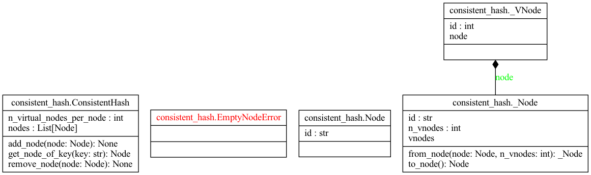

# 05-design-consistent-hashing

## Tech Specs

### Goal

Implement consistent hash from chapter 5.

### Requirements

- The virtual node technique must be implemented.
- The number of nodes and number of virtual nodes must be user configurable.

## Usage

### Installation

Pre-requisites are as follows.

- python >= 3.10
- clone this repo

Install as follows.

```bash
$ poetry install
```

### How To Use

```python
from consistent_hash import ConsistentHash, Node


# Create consistent hash with nodes
consistent_hash = ConsistentHash(
        nodes=[
            Node(id="1"),
            Node(id="2"),
            Node(id="3"),
        ],
        n_vnodes_per_node=200  # This is optional. Default is 200
    )

# Get node of key you want to hash in consistent_hash
node = consistent_hash.get_node_of_key("heumsi")

# Check the node
print(node)  # Node(id="1")
```

## System Design


